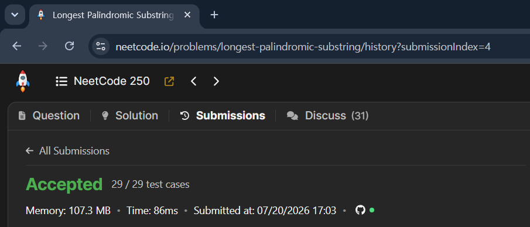

# 07/20

## 잔디심기

## 블로그 정리

[LeetCode 5. Longest Palindromic Substring](https://keyone957.tistory.com/34)

## 면접 스터디 정리

<aside>

### 좋은 해시 함수란?

> 입력값을 테이블의 전체 영역에 최대한 균등하게 분산시키면서 빠르게 계산할 수 있는 함수

#### 1. 입력 값을 균등하게 분산해야함.

ex)

버킷 0 : 데이터 90개 버킷 0 : 데이터 11개

버킷 1 : 데이터 1개 ⇒ 버킷 1 : 데이터 10개

버킷 2 : 데이터 2개 ….. 버킷 2 : 데이터 9개 ….

왼쪽 보다는 오른쪽이 더 좋움

#### 2. 해시 충돌이 적어야함

> 충돌이 발생할 확률을 최대한 낮추고 특정 위치에 집중되지 않도록 해야 함

#### 3. 같은 입력은 항상 같은 결과를 반환해야함

#### 4. 계산 속도가 빨라야함.

> 해시 테이블은 데이터를 검색 or 삽입할 때 마다 해시 함수를 호출함 따라서 속도 빨라야함.

#### `정리`

> 빠르게 계산되면서 같은 입력에는 같은 값을 반환하고, 서로 다른 입력을 전체 버킷에 균등하게 분산시키는 함수가 좋은 해시 함수이다

> 각 해시 key가 균등하게 분배되어 이를 통해 해시 충돌을 최대한 막는 것이 좋은 함수

</aside>

### 

<aside>

### 배열 vs 연결 리스트 정리

> **`배열`**은 데이터를 연속된 메모리에 저장하기 때문에 인덱스를 통한 접근이 **`O(1)`** 이고 캐시 효율이 좋습니다. 하지만 중간 삽입과 삭제 시 요소를 이동해야 하므로 **`O(n)`** 의 비용이 발생합니다.  
> 연결리스트는 노드들이 포인터로 연결되어 있어 특정 위치 접근은 **`O(n)`** 이지만 삽입 or 삭제 시에는 각 노드가 다음 노드 위치를 알고 있으므로 이 위치 포인터만 수정하면 되므로 **`O(1)`** 걸립니다. 대신 포인터 저장 비용이 필요하고 캐시 효율이 낮습니다.

</aside>

<aside>

### 멀티스레딩의 문제점 및 해결 방법

### **`1. Race Condition`**

> 여러 스레드가 같은 공유 데이터에 동시에 접근하여 실행 순서에 따라 결과가 달라지는 문제

ex) 두 스레드가 동시에 하나의 변수에 접근하여 조작하면 원하는 결과가 나오지 않을 수 있음

공유 변수 count=0;

쓰레드 a : count ++; / 쓰레드 b : count++;

#### **해결 방법**

동기화 기법 (뮤텍스, 세마포어, 모니터)

### `2. Critical Section 문제`

> 여러 스레드가 동시에 접근하면 안되는 공유 코드 영역 ⇒ 이 구간에 여러 스레드가 동시에 들어가면 데이터가 잘못될 수 있다.

#### **해결 방법**

임계 영역을 설정하고 상호 배제를 보장한다.

한 스레드가 입계 영역에 진입 → 다른 스레드 대기 → 작업 종료 후 Lock을 해제

### **`3. 데드락`**

> 두 개 이상의 스레드가 서로 상대방이 가진 자원을 기다리며 영원히 멈추는 문제

### **`4. 기아 현상`**

> 특정 스레드가 계속 자원을 얻지 못하고 실행되지 못하는 문제

#### 해결 방법

* 공정한 스케쥴링 사용

* 대기 시간이 긴 스레드의 우선순위를 높이는 Aging 적용  
  
  </aside>

### 

<aside>

### 멀티프로세싱의 문제점 및 해결 방법

### `1. 컨텍스트 스위칭 비용`

> 프로세스를 전환할 때는 스레드 전환보다 더 많은 CPU상태와 메모리 관련 정보를 교체해야 함.

#### 해결 방법

* 프로세스 수를 CPU 코어 수에 맞게 제한
* 작업을 너무 작은 단위로 분리하지 않기

### `2. 메모리 사용량 증가`

> 각 프로세스는 별도의 주소 공간을 가지므로 같은 데이터를 사용하더라도 각각 메모리를 차지할 수 있음

#### 해결 방법

* 프로세스 수 제한
* 공유 메모리 사용

### `3. 프로세스 간 데이터 공유가 어려움`

> 프로세스는 메모리를 공유하지 않기 때문에 직접 변수에 접근할 수 없음

#### 해결 방법

⇒ IPC 사용

</aside>

### IPC

<aside>

> 서로 다른 프로세스가 데이터를 주고 받거나 실행을 동기화하기 위한 통신 방법

프로세스는 각각 독립된 메모리 공간을 사용한다. 따라서 a프로세스에서 b프로세서의 변수에 직접 접근하지 못함. 이때 사용하는것이 IPC임

</aside>

<aside>

사용 이유
프로세스 간 독립성을 유지하면서 협력 작업을 하기 위해

</aside>

### 포트폴리오 내부 내용 다듬기

