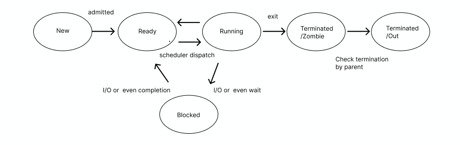

# 07/30

잔디 심기
-----

[NeetCode | Coding Interview Prep, Courses, Versus Mode](https://neetcode.io/problems/permutation-string/history?list=neetcode250&submissionIndex=1)

## 블로그 정리

[LeetCode 567. Permutation in String](https://keyone957.tistory.com/42)

## 이력서 제출

## VR 프로젝트 작업

- SisterPuppy.cs 구현

- 각 페이즈 구현

------

CS 공부
-----

### [프로세스 테이블]

<aside>

#### 프로세스 테이블

> 현재 시스템에 존재하는 모든 프로세스의 정보를 관리하기 위한 데이터 구조

* 시스템에 오직 하나만 존재

* 프로세스에 관한 모든 정보를 관리하는 PCB들로 구성되어있음  
  
  </aside>

### [PCB]

<aside>

#### PCB - 프로세스 제어 블록

> 프로세스와 관련된 정보를 저장하는 자료 구조

* 커널 영역에 생성됨.
* 프로세스 생성 시에 만들어지고 실행이 끝나면 폐기됨
  * 새로운 프로세스가 생성 = 운체가 PCB를 생성했다
  * 프로세스가 종료되었따 = 운체가 해당 PCB를 폐기 했다.

#### PCB에 들어있는 정보

1. 프로세스 ID (PID)
* 특정 프로세스를 식별하기 위해 부여하는 고유한 번호
2. 부모 프로세스 ID (PPID)
* 프로세스를 생성한 부모 프로세스의 PID
3. 레지스터 값
* 이전까지 사용했던 레지스터의 중간값들을 모두 복원함 그래야만 이전까지 진행했던 작업들을 이어 실행할 수 있음
4. 프로세스 상태
* 현재 프로세스가 어떤 상태에 있는지 나타냄
5. CPU 스케줄링 정보
* 프로세스가 언제 어떤 순서로 CPU를 할당받을지에 대한 정보
6. 메모리 관리 정보
* 프로세스가 사용중인 물리 메모리의 위치와 크기, 페이지 테이블 주소 등 메모리 관리와 관련된 정보  
  
  </aside>

### [프로세스의 상태]

<aside>

#### 프로세스 상태

1. **생성 상태 - New**
   
   * 프로세스 생성 및 메모리 할당과 자원 적재가 이루어지는 초기 상태

2. **준비 상태 - Ready**
   
   * 프로세스가 실행 준비가 되어 스케줄링을 기다리는 상태. 준비 큐에서 대기 중, CPU가 할당되면 실행 상태로 전환

3. **실행상태 - Running**
   
   * 프로세스가 CPU를 사용하여 실제로 실행되고 있는 상태.

4. **대기 상태 - Blocked / Wait**
   
   * 프로세스가 자원이나 입출력 작업을 기다리는 상태. 요청이 완료되면 Ready 상태로 전환

5. **종료 상태 - Terminated**
   
   * **Zombie 상태**
     ⇒ 프로세스가 불완전 종료된 상태
     프로세스가 차지하고 잇던 메모리와 할당 받았던 자원들을 모두 커널에 의해 반환 커널에 의해 열어 놓은 파일도 닫힘
     그러나 프로세스 테이블의 항목과 PCB가 여전히 시스템에서 제거 되지 않은 상태
     프로세스가 남긴 종료 코드 (PCB안에 있음)를 부모 프로세스가 읽어가지 않아 완전히 종료되지 않은 상태
   
   * **Out 상태**
     ⇒ 프로세스가 종료 하면서 남긴 종료 코드를 부모 프로세스가 읽어가서 완전히 종료된 상태
     프로세스 테이블의 항목과 PCB가 시스템에서 완전히 제거된 상태

</aside>
