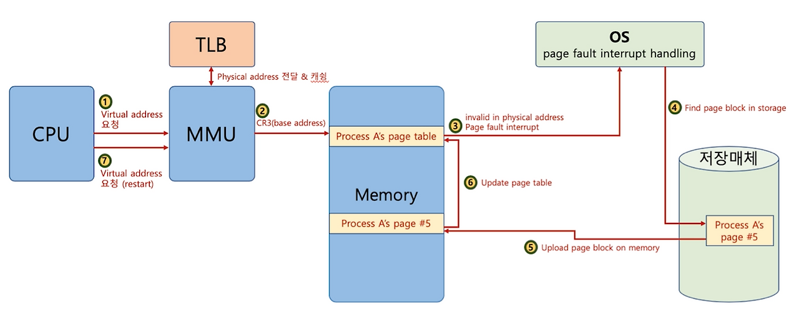

08/05
=====

잔디 심기
-----

***

[4Sum - LeetCode](https://leetcode.com/problems/4sum/description/)

⇒ 백트래킹 방식과 투 포인터를 활용한 문제 풀이 방식

****

## 블로그 정리

[LeetCode 18. 4Sum](https://keyone957.tistory.com/46)

****

## 면접 스터디 질문 준비

****

## CS 공부

****

### [인터럽트]

### 인터럽트

> CPU가 현재 실행 중인 작업을 잠시 멈추고 발생한 이벤트를 먼저 처리하도록 만드는 신호. 이벤트 처리가 끝나면 원래 하던 작업으로 복귀

#### 필요한 이유

* CPU가 어떤 작업이 끝날 때까지 계속 확인만 하고 있다면 그 시간동안 CPU는 아무 일도 못하고 낭비됨. 따라서 인터럽트가 있으면 CPU는 그 작업을 요청해 놓고 다른 일을 하다가 작업이 끝났다는 신호(인터럽트)가 오면 그때 처리하면 됨.  
  
  
  
  

</aside>

### [인터럽트의 종류]

### 동기 인터럽트 (예외,트랩)

> CPU에 의해 발생하는 인터럽트 CPU가 명령어들을 수행하다가 발생하는 인터럽트

* 발생 주체 → 실행 중인 프로그램
* 현재 실행 중인 프로세스, 명령어와 직접적인 인과관계
* 같은 프로그램, 같은 입력이면 항상 같은 지점에서 재현 됨

EX)

* 시스템 콜 : read(), write() 같은 함수 호출 시 의도적으로 발생시킴

* 페이지 폴트 : 유효하지 않은 페이지 접근 시

* 잘못된 명령어 실행 시  

### 비동기 인터럽트 (하드웨어 인터럽트)

> 주로 입출력장치에 의해 발생하는 인터럽트. 외부 장치가 CPU에게 신호를 보내는 것

* 발생 주체 → 외부 장치

EX) 키보드 입력, 마우스 클릭, 디스크 IO완료 등

### [인터럽트 처리 과정]

### 인터럽트 요청 신호

> 인터럽트는 CPU의 정상 적인 실행 흐름을 끊는 것 . 따라서 인터럽트를 해도 되는지 CPU에게 보내는 신호

### 인터럽트 플래그

> 하드웨어 인터럽트를 받아들일지 무시할 지 결정하는 플래그

### 인터럽트 서비스 루틴 (ISR) or 인터럽트 핸들러

> 인터럽트가 발생했을 때 해당 인터럽트를 처리하고 어떻게 작동해야 할지에 대한 정보로 이루어진 프로그램

### 인터럽트 벡터

> 인터럽트 서비스 루틴을 식별하기 위한 정보

* 인터럽트 벡터를 알면 ISR의 시작 주소를 알 수 있기 때문에 CPU는 인터럽트 벡터를 통해 특정 ISR을 처음부터 실행할 수 있음.  

### 인터럽트 처리 과정

1. 인터럽트 발생
2. 현재 상태 저장
3. 인터럽트 벡터 확인
4. ISR 실행
5. 상태 복원 및 재개

### 하드웨어 인터럽트 처리 순서

1. 입출력 장치는 CPU에 인터럽트 요청 신호를 보냄

2. CPU는 실행 사이클이 끝나고 명령어를 인출하기 전 항상 인터럽트 여부를 확인

3. CPU는 인터럽트 요청을 확인하고 인터럽트 플래그를 통해 현재 인터럽트를 받아들일 수 있는 지 여부를 확인

4. 인터럽트를 받아들일 수 있다면 CPU는 지금까지의 작업을 백업

5. CPU는 인터럽트 벡터를 참조하여 ISR을 실행함.

6. ISR이 끝나면 백업해 둔 작업을 복구하여 실행을 재개함  
   
   </aside>

### [MMU]

<aside>

### MMU

> CPU가 사용하는 논리주소를 실제 물리 메모리의 물리 주소로 변환해주는 하드웨어 장치

CPU ⇒ 가상 주소만 앎
MMU ⇒ 실제 메모리 어디에 있는지 찾아줌

### [페이지 폴트가 발생 ⇒ 재개까지 과정]

#### 1. 페이지 폴트 발생

* MMU유효 비트 0을 감지하고 트랩을 발생시켜 커널 모드로 전환

#### 2. CPU 상태 백업

* 현재 레지스터, PC 등을 PCB 에 저장

#### 3. 페이지 폴트 처리 루틴 실행

정당성 검사 → 필요시 페이지 교체 → 디스크에서 페이지를 프레임에 적재 → 페이지 테이블의 유효 비트를 1로 갱신

#### 4. 상태 복원 및 명령어 재실행 (다시 사용자 모드로 전환)

* 백업 했던 CPU 상태를 복원하고 페이지 폴트를 일으켰던 명령어를 처음부터 다시 실행 ⇒ 이번엔 유효 비트가 1이므로 정상 접근 성공 
